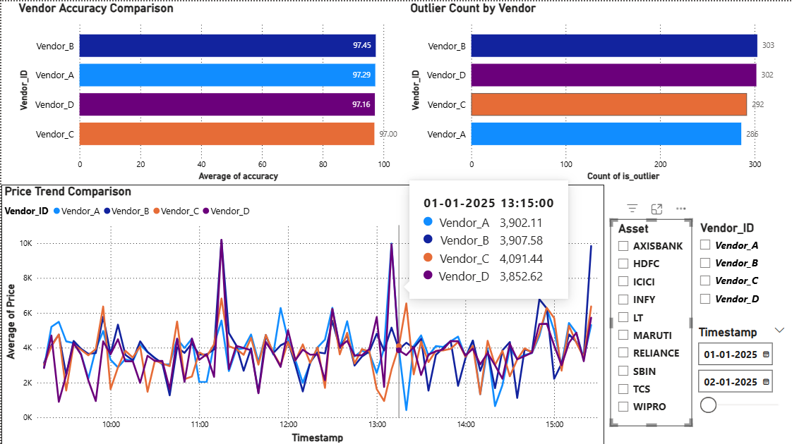
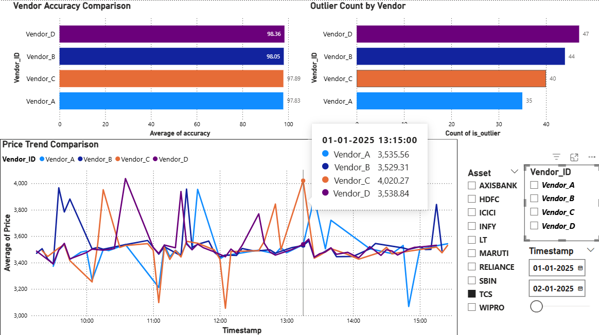
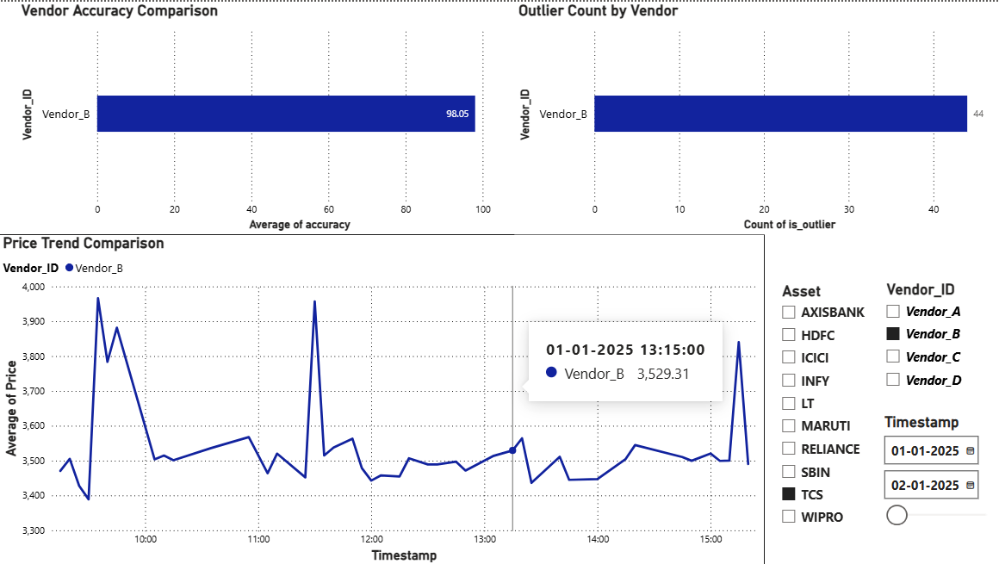
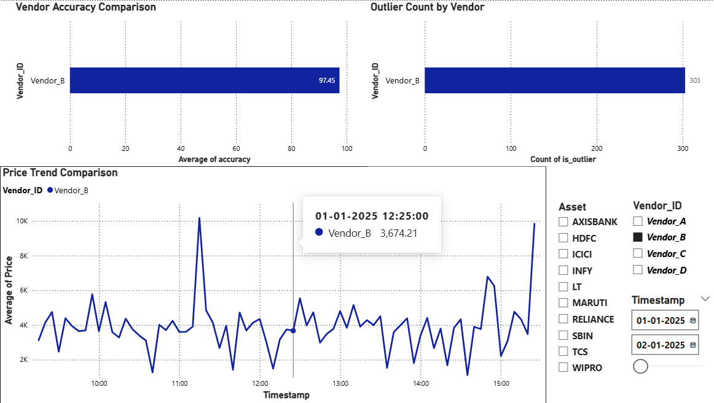

# market-data-analytics
Market Data Analytics Price Challenge Reporting System
# 📊 Market Data Analytics Price Challenge Reporting System


---

## 🔷 📌 Project Overview

This project implements a **Market Data Analytics System** that evaluates and compares price data from multiple vendors. It identifies inconsistencies, detects anomalies, and provides actionable insights into vendor performance.

The system uses an **ETL pipeline**, **SQL-based analytics**, and **interactive dashboards** to ensure pricing transparency and reliability.

---

## 🔷 🎯 Objectives

* Compare price feeds across multiple vendors
* Calculate deviation and accuracy metrics
* Detect anomalies and outliers
* Rank vendors based on performance
* Deliver insights via visualization dashboards

---

## 🔷 🏗️ System Architecture

```
Raw Dataset (CSV)
        ↓
Data Cleaning (Pandas)
        ↓
ETL Transformations
        ↓
SQLite Database
        ↓
SQL Analysis
        ↓
Power BI Dashboard
```

---

## 🔷 🧰 Tech Stack

| Layer           | Tools Used      |
| --------------- | --------------- |
| Programming     | Python (Pandas) |
| Database        | SQLite / SQL    |
| Data Processing | ETL Pipeline    |
| Visualization   | Power BI        |

---

## 🔷 📂 Dataset Description

The dataset contains ~3000 records with:

| Column    | Description              |
| --------- | ------------------------ |
| vendor_id | Unique vendor identifier |
| asset     | Asset/Instrument name    |
| price     | Price provided by vendor |
| timestamp | Time of data capture     |

---

## 🔷 🔄 ETL Pipeline

### 🔹 Extract

* Data loaded from CSV file

### 🔹 Transform

* Removed duplicates and null values
* Converted timestamps
* Computed key metrics:

  * Average Price
  * Price Deviation
  * Accuracy Score
  * Outlier Detection

### 🔹 Load

* Stored data in structured SQLite tables

---

## 🔷 📊 Key Metrics

* **Average Price** per asset
* **Deviation** = Vendor Price − Average Price
* **Accuracy Score** = (1 − |Deviation| / Avg Price) × 100
* **Outlier Detection** using threshold

---

## 🔷 🗄️ Database Schema

### 📌 Fact Table: `fact_prices`

* vendor_id
* asset
* price
* timestamp

### 📌 Processed Table: `processed_prices`

* vendor_id
* asset
* price
* timestamp
* avg_price
* deviation
* accuracy
* is_outlier

---

## 🔷 🧠 SQL Analytics

Key insights generated using SQL:

* 🏆 Best Performing Vendor
* ⚠️ Most Inconsistent Vendor
* 📉 Asset Price Volatility
* 🚨 Outlier Detection per Vendor

---

## 🔷 📈 Dashboard Features

* 📊 Vendor Accuracy Comparison
* 📈 Price Trend Analysis
* ⚠️ Outlier Detection Visualization
* 🏆 Vendor Ranking

---

## 🔷 📸 Dashboard Preview





```
```

## 🔷 ▶️ How to Run

### 1️⃣ Clone Repository

```
git clone https://github.com/your-username/market-data-analytics.git
cd market-data-analytics
```

### 2️⃣ Install Dependencies

```
pip install pandas
```

### 3️⃣ Add Dataset

Place your file:

(market_data__analytics_dataset.csv)

### 4️⃣ Run ETL Script


(market_data_analytics_project.ipynb)

---
## 🔷 📦 Project Structure

```
market-data-analytics/
│
├── data/
│   └── market_data_analytics_dataset.csv
│
├── scripts/
│   └── market_data_analytics_project.ipynb
│
├── database/
│   └── market_data_analytics_dataset.db
│
├── outputs/
│   └── processed_prices.csv
│
├── screenshots/
│   └── dashboard images
│
└── README.md
```

---

## 🔷 📌 Output

* ✔ Cleaned dataset
* ✔ Processed analytical data
* ✔ SQLite database
* ✔ Vendor performance insights
* ✔ Interactive dashboard

---

## 🔷 🚀 Future Enhancements

* Real-time streaming pipeline
* Machine Learning anomaly detection
* Automated alert system
* API integration with live market data

---

## 🔷 💼 Use Cases

* Financial data quality monitoring
* Vendor performance evaluation
* Trading system validation
* Risk and compliance analysis

---

## 🔷 👨‍💻 Author

**Keerthi Vasan**
📍 Aspiring Data Analyst / ML Engineer

---

## 🔷 ⭐ Support

If you found this project useful, give it a ⭐ on GitHub!

---


